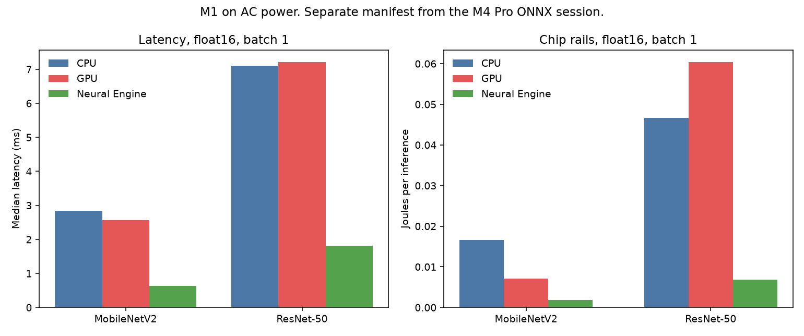

# Comparativo de performance: CPU, GPU e NPU

Medição de 26 de setembro de 2026. O manuscrito está em `artigo/artigo-v2.md`. O arquivo `artigo/artigo-base.md` é o rascunho anterior. Os números abaixo são o que as duas corridas mostraram.

Cada máquina tem o próprio manifesto. O tempo de uma não entra no eixo da outra. A comparação entre elas é o ganho de cada acelerador contra a CPU do mesmo computador.

## Máquinas

| | Windows | Mac |
|---|---|---|
| Máquina | Ryzen 9 7900X3D, RTX 4070 Ti 12 GB | MacBook Pro, Apple M4 Pro, 24 GB |
| CPU | 12 núcleos, 24 threads | 8 de desempenho e 4 de eficiência |
| GPU | NVIDIA GeForce RTX 4070 Ti | 16 núcleos |
| NPU | ausente | Neural Engine de 16 núcleos |
| Runtime | ONNX Runtime 1.30 | Core ML, coremltools 9.0 |
| Precisão da coluna principal | FP32, TF32 desligado na GPU | float16 para a corrida em que o Neural Engine executou |
| Energia | potência de bordo da placa | trilhos estimados do chip |
| Alimentação | desktop | tomada, bateria carregada, modo automático |
| Evidência | `results/windows-workstation/20260926T195237Z` | `results/apple-m4-pro/20260926T204025Z` |

Modelos: MobileNetV2 e ResNet-50, entrada `1x3x224x224`, pesos `IMAGENET1K_V2` nos dois. Três sessões, 20 iterações de aquecimento fora da conta, 100 medições, pausa de 60 s. O Windows varreu os batches 1, 8 e 32. O Mac mediu 1 e 8. O Mac carrega o ONNX FP32 exportado pelo mesmo script; o SHA-256 do arquivo não é o da workstation, porque o protobuf não saiu idêntico. O Core ML Tools 9 não converte ONNX, então o grafo passa por `onnx2torch` antes do programa Core ML.

No Mac, uma barra só entra se o plano de execução coloca pelo menos metade do peso no dispositivo pedido. A sessão citada também amostrou `ane_power`: 0 mW nas corridas de CPU e GPU, e cerca de 2 W a 3 W nas corridas float16 do Neural Engine. Em float32, `cpuAndNeuralEngine` ficou na CPU nos dois modelos. Isso não é resultado de NPU.

## Dentro de cada máquina

Batch 1. No Windows a precisão é FP32. No M4 Pro é float16, a única precisão em que o Neural Engine executou.


| | CPU | GPU | Neural Engine |
|---|---:|---:|---:|
| Windows, MobileNetV2, FP32 | 3,04 ms | 2,38 ms | — |
| Windows, ResNet-50, FP32 | 32,7 ms | 3,32 ms | — |
| M4 Pro, MobileNetV2, float16 | 2,07 ms | 0,87 ms | 0,43 ms |
| M4 Pro, ResNet-50, float16 | 4,15 ms | sem corrida válida | 1,01 ms |

No modelo pequeno, CPU e GPU ficam próximas. No ResNet-50 a distância abre. Na 4070 Ti ela é de cerca de dez vezes contra o Ryzen. No M4 Pro o Neural Engine faz o ResNet-50 em cerca de um quarto do tempo da CPU. O pedido de GPU para esse ResNet-50 em batch 1 ficou 56% na CPU e saiu do gráfico.

O p95 da CPU no Windows, no ResNet-50, passa de 80 ms. A mediana é o centro da comparação. A máquina não estava isolada, e esse p95 ainda não serve como número de artigo.


Na 4070 Ti o throughput sobe do batch 1 para o 8 e depois empacota: MobileNetV2 chega a cerca de 2.500 imagens por segundo, ResNet-50 fica perto de 1.000. A CPU do Ryzen quase não muda com o batch.

No M4 Pro, em float16, o Neural Engine segue na frente no batch 8. No MobileNetV2 a GPU integrada chega perto dele (2.623 contra 2.892 imagens por segundo). No ResNet-50 o Neural Engine permanece acima da GPU (953 contra 532).

## Entre as duas máquinas

O eixo comum é o ganho contra a CPU da própria máquina, na mesma precisão, em batch 1. A linha horizontal é 1: o acelerador empata com essa CPU.


| Acelerador | MobileNetV2 | ResNet-50 |
|---|---:|---:|
| RTX 4070 Ti, FP32, contra o Ryzen | 1,3× | 9,9× |
| GPU do M4 Pro, float16, contra a CPU do M4 | 2,4× | sem corrida válida |
| Neural Engine, float16, contra a CPU do M4 | 4,9× | 4,1× |

A 4070 Ti rende no modelo pesado. O Neural Engine rende já no modelo pequeno, em float16. São comportamentos diferentes, medidos em computadores diferentes. 0,43 ms do Neural Engine e 2,38 ms da 4070 Ti não formam um ranking: outro chip, outro runtime, outra precisão e outra definição de latência.

Em float32 no M4 Pro o Neural Engine não aparece. Onde a GPU foi válida, o MobileNetV2 ficou em 3,28 ms na CPU e 1,08 ms na GPU. O ResNet-50 em batch 1 não teve GPU válida. Em batch 8, a CPU ficou em 48,3 ms e a GPU em 19,4 ms.

## Energia

Só a RTX 4070 Ti tem joule de placa, e é potência de bordo, não da tomada. O Mac agora tem outra grandeza: a soma estimada dos trilhos de CPU, GPU e Neural Engine numa janela sustentada de 3 segundos. Não é a tomada, e não entra no mesmo gráfico da placa. No MobileNetV2 em float16 e batch 1, essa soma deu 0,013 J na CPU, 0,011 J na GPU e 0,0018 J no Neural Engine. O trilho do Neural Engine ficou em 0 mW nas outras duas corridas.


No batch 1 a placa gasta mais joule por imagem porque a potência de bordo se divide por pouco trabalho. No ResNet-50 em FP32, o custo cai de 0,34 J no batch 1 para cerca de 0,22 J no batch 32, com a placa acima de 200 W. Em float16 e batch 1 o ResNet-50 ficou mais lento que em FP32 e, por isso, mais caro por imagem. Precisão menor não ganhou sozinha.

## M1, manifesto separado

`results/apple-m1/20260926T203102Z` é um MacBook Pro M1, 16 GB, macOS 14.8.9, na tomada, com pausa de 60 s e `powermetrics`. Em float16 e batch 1 o Neural Engine executou: 0,63 ms e 0,0019 J no MobileNetV2, 1,81 ms e 0,0068 J no ResNet-50. O trilho ANE ficou em cerca de 1,9 W e 3,5 W nessas corridas e em 0 W na CPU e na GPU. Em float32 o plano ficou na CPU.

Essa sessão não entra nas figuras do M4 Pro. O MobileNetV2 dela saiu do traço torchvision `IMAGENET1K_V1`, não do ONNX `IMAGENET1K_V2` da sessão citada. O opset é o do macOS 14. A janela de energia foi de 4 s. O ResNet-50 usou `IMAGENET1K_V2`, mas o programa compilado não é o do M4 Pro.



## O que esta corrida não sustenta

- Ordenar Neural Engine, RTX 4070 Ti e Ryzen num único gráfico de milissegundos.
- Tratar float32 do M4 Pro ou do M1 como teste de NPU. O plano ficou na CPU.
- Tratar a sessão do M1 como repetição do M4 Pro. O chip, o macOS e o checkpoint do MobileNetV2 são outros.
- Concluir eficiência entre as máquinas. O joule da 4070 Ti é potência de placa. O joule do M4 Pro é estimativa dos trilhos do chip. Nenhum dos dois é a tomada, e o pacote do Ryzen continua de fora.
- Tratar o arquivo ONNX do Mac como cópia byte a byte do arquivo da workstation. O exportador e os nomes dos pesos são os mesmos. O SHA-256 não coincidiu.
- Tratar o 0,87 ms da GPU no MobileNetV2 em batch 1 como um número sem checagem. Na sessão completa o aquecimento de 20 iterações não foi marcado como estável. Uma repetição com 80 iterações, na tomada, estabilizou em 0,86 ms.
- Ler o p95 da CPU do Windows como latência estável.

## Como reproduzir

Windows, a partir da raiz do repositório:

```bash
py -3.11 -m venv .venv
.venv\Scripts\python.exe -m pip install -r requirements.txt
.venv\Scripts\python.exe -m pip install torch torchvision --index-url https://download.pytorch.org/whl/cpu
.venv\Scripts\python.exe -m bench
.venv\Scripts\python.exe -m comparison
```

Mac, na tomada, com as mesmas contagens:

```bash
python -m benchmark run --batch 1 --batch 8 --pause-seconds 60
```

O comando avisa quando a máquina está na bateria. As figuras comparativas saem de `python -m comparison` e leem as duas pastas citadas acima.
