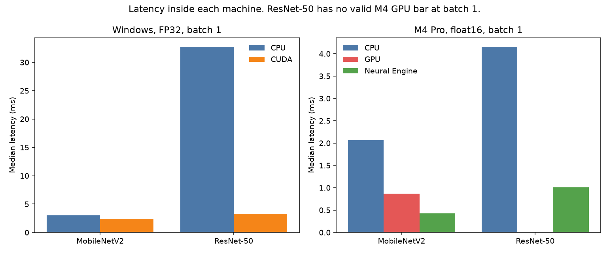
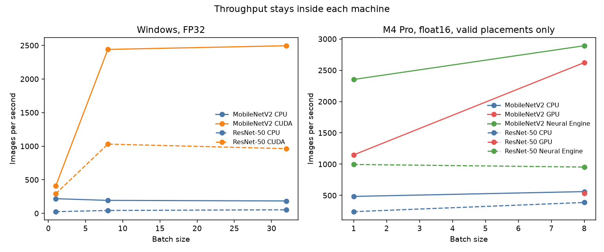
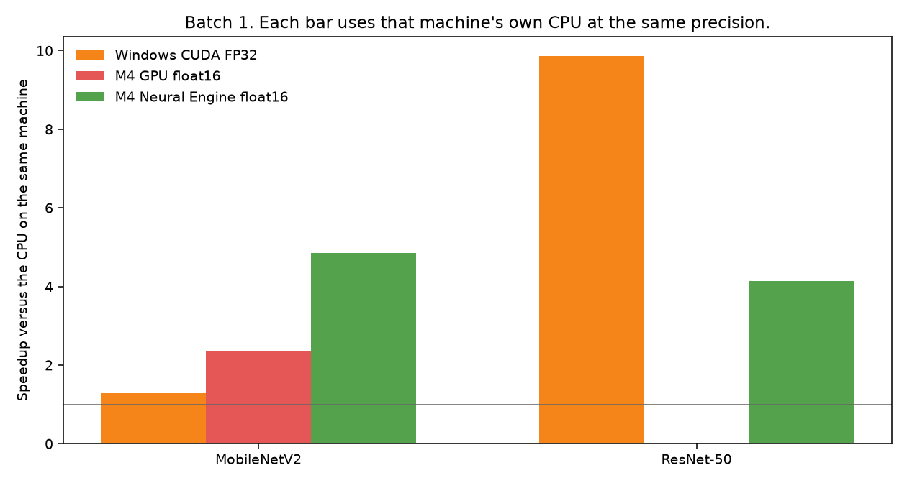
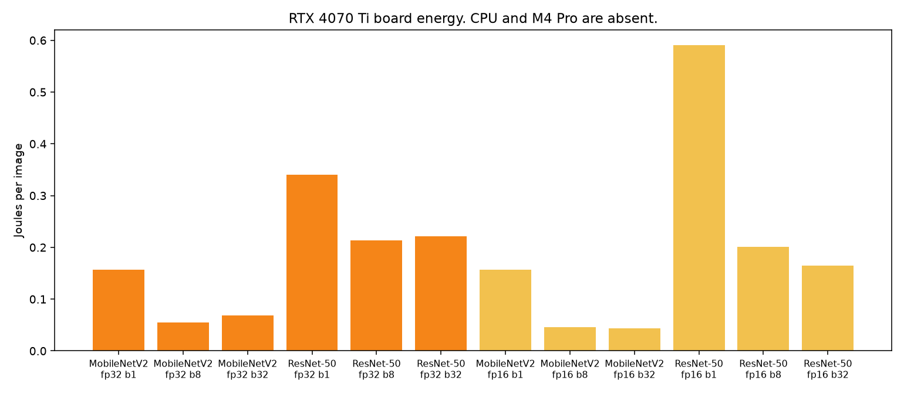

# Inferência de redes convolucionais em CPU, GPU e Neural Engine

**Versão 2.** Este é o manuscrito de leitura. O rascunho anterior está em `artigo/artigo-base.md` e não descreve o estudo que os dados sustentam. As figuras citadas estão em `results/comparison/20260926/`.

O texto é um relato experimental de 26 de setembro de 2026. Ele não está em formato de submissão. Faltam revisão de literatura fechada e uma grandeza de energia comum entre as duas máquinas.

## Resumo

O trabalho mede a inferência de MobileNetV2 e ResNet-50 em duas plataformas e recusa a comparação de milissegundos entre elas. Na workstation, ONNX Runtime executa os modelos em FP32 na CPU AMD Ryzen 9 7900X3D e na GPU NVIDIA GeForce RTX 4070 Ti. Não há NPU nessa máquina. No MacBook Pro com Apple M4 Pro, Core ML executa os modelos em CPU, GPU e Neural Engine. Uma corrida só entra na coluna do dispositivo quando o plano de computação coloca pelo menos metade do peso nesse dispositivo.

Em batch 1 e FP32, a 4070 Ti reduz a mediana de 3,04 ms para 2,38 ms no MobileNetV2 (1,3 vez em relação à CPU) e de 32,7 ms para 3,32 ms no ResNet-50 (9,9 vezes). No M4 Pro, em float16 e batch 1, o Neural Engine executa os dois modelos: 0,43 ms no MobileNetV2, contra 0,87 ms na GPU e 2,07 ms na CPU, e 1,01 ms no ResNet-50, contra 4,15 ms na CPU. O pedido de GPU para o ResNet-50 nesse batch ficou com 56% do peso na CPU e sai da coluna de GPU. Em float32, o pedido ao Neural Engine executou na CPU nos dois modelos.

O aumento do batch faz a GPU da workstation e a GPU do M4 Pro aproveitarem paralelismo que o batch 1 não ocupa. No MobileNetV2 em float16 e batch 8, a GPU do M4 Pro chega a 2.623 imagens por segundo e o Neural Engine a 2.892. No mesmo ponto, a soma estimada dos trilhos do chip dá 0,0018 J por predição no Neural Engine, contra 0,013 J na CPU. Essa conta não é a tomada e não se compara ao joule de bordo da 4070 Ti.

**Palavras-chave:** inferência; CPU; GPU; Neural Engine; Core ML; ONNX Runtime.

## 1. Introdução

CPU, GPU e NPU aparecem juntas na discussão sobre onde executar um modelo de inteligência artificial. A CPU é um processador de propósito geral. A GPU organiza muitas unidades para trabalho paralelo. A NPU, neste estudo o Neural Engine da Apple, é um acelerador desenhado para operações de redes neurais. Levantamentos de aceleradores mostram que desempenho, throughput e potência variam com a carga, a precisão numérica e o fato de a tarefa ser treino ou inferência (REUTHER et al., 2019; MOHAIDAT; KHALIL, 2024).

O rascunho inicial deste projeto perguntava como as três arquiteturas se comportam em desempenho, uso de recursos e eficiência energética, como se a resposta coubesse num único ranking. A medição não autoriza essa pergunta. As duas máquinas não compartilham runtime, precisão da coluna principal nem domínio de potência. Uma delas não tem NPU. O software pode ainda devolver a execução à CPU depois de o experimento ter pedido o acelerador.

Este manuscrito responde uma pergunta menor, que os registros fecham:

Como CPU, GPU e, quando o plano de execução confirma o acelerador, o Neural Engine se comportam na inferência de MobileNetV2 e ResNet-50, se o tempo de uma máquina não entra no eixo da outra?

A eficiência energética permanece sem uma grandeza comum entre as máquinas. A workstation tem joule de placa. O M4 Pro tem a soma estimada dos trilhos do chip. As duas contas não se subtraem.

### 1.1 Objetivos

- Medir latência e throughput de inferência dos dois modelos em cada plataforma, com mediana e percentil 95 de três sessões.
- Publicar o dispositivo que executou o grafo, não o nome pedido à API.
- Comparar cada acelerador com a CPU da mesma máquina, na precisão em que essa corrida foi válida.
- Registrar a energia da placa NVIDIA com o limite da grandeza, e não estender essa grandeza às outras arquiteturas.

Ficam fora deste manuscrito o treino, a acurácia de classificação, a ocupação percentual de CPU e GPU, a potência da tomada, o pacote do Ryzen e qualquer ordenação absoluta entre Neural Engine e RTX 4070 Ti.

## 2. Fundamentação

A distinção usada para ler os resultados é de função, não de ranking. A CPU executa controle, preparação e também o modelo, com poucos núcleos largos e cache próximo. A GPU rende quando a carga se divide em muitas operações semelhantes. A NPU rende quando as operações cabem no conjunto que o fabricante acelera, em geral na inferência local (REUTHER et al., 2019; MOHAIDAT; KHALIL, 2024).

Duas consequências seguem dessa distinção e são testáveis.

A primeira é que paralelismo não aparece em toda carga. Um batch de uma imagem pode deixar a GPU discreta perto da CPU no modelo pequeno e muito à frente no modelo maior. O mesmo vale, em outra escala, para a GPU integrada.

A segunda é que o nome do acelerador não é a execução. Um runtime pode aceitar um pedido de NPU e colocar o grafo na CPU porque a precisão, o formato ou o operador não são absorvidos. Sem uma evidência de posicionamento, a coluna NPU mistura fallback e aceleração.

A tabela conceitual do rascunho inicial continua útil como vocabulário: flexibilidade na CPU, paralelismo na GPU, especialização na NPU. Ela não é resultado. As figuras conceituais anunciadas naquele rascunho não foram produzidas e não entram neste texto.

## 3. Método

### 3.1 Modelos e o que não é idêntico entre as máquinas

Os modelos são MobileNetV2 e ResNet-50, com entrada `1×3×224×224`. O escopo é inferência. A acurácia ImageNet não foi medida. A entrada de tempo é determinística e reutilizada entre dispositivos, para que a diferença de latência não venha de uma imagem diferente.

Na workstation, os pesos saem do torchvision 0.29. MobileNetV2 e ResNet-50 usam `IMAGENET1K_V2`. O grafo é exportado para ONNX, opset 17, em FP32 e em FP16, e executado pelo ONNX Runtime 1.30.

No Mac, o FP32 é exportado pela mesma função, `bench.export_models.export_fp32`. Os dois modelos ficam em `IMAGENET1K_V2`. O Core ML Tools 9 não tem conversor de ONNX. O arquivo é carregado com `onnx2torch` e esse módulo é que vira o programa Core ML, com coremltools 9.0. O SHA-256 desse ONNX não coincide com o hash registrado na workstation. O procedimento e o nome dos pesos são os mesmos. Os bytes do protobuf não são. A acurácia ImageNet não foi medida.

### 3.2 Plataformas

| | Workstation | MacBook Pro |
|---|---|---|
| CPU | AMD Ryzen 9 7900X3D, 12 núcleos, 24 threads | Apple M4 Pro, 8 de desempenho e 4 de eficiência |
| GPU | NVIDIA GeForce RTX 4070 Ti, 12.282 MiB, driver 581.42 | Apple M4 Pro, 16 núcleos, Metal 3 |
| NPU | ausente | Neural Engine de 16 núcleos |
| GPU excluída | Radeon integrada | — |
| Sistema | Windows 10.0.26200 | macOS 15.4.1 |
| Runtime | ONNX Runtime 1.30, provedores CPU e CUDA | Core ML |
| Alimentação | desktop | tomada, bateria em 100%, modo automático |
| Pausa entre sessões | 60 s | 60 s |
| Evidência | `results/windows-workstation/20260926T195237Z` | `results/apple-m4-pro/20260926T204025Z` |

A GPU integrada da workstation não ocupa o lugar de uma NPU. No M4 Pro medido, a GPU de 16 núcleos e o Neural Engine são blocos distintos. Este chip não entra no texto como uma GPU com acelerador neural por núcleo. Essa descrição pertence a outra geração e exigiria outra corrida.

Na workstation, a latência da GPU inclui cópia para o dispositivo, cálculo e cópia de volta, com sincronização antes de parar o cronômetro. TF32 ficou desligado na coluna FP32. A CPU usou 24 threads intra-operação. No Mac, a latência é a chamada síncrona de predição do Core ML, já com o modelo carregado. São relógios de plataformas diferentes. Por isso o manuscrito não subtrai um milissegundo do outro.

### 3.3 Plano experimental

Cada sessão descarta 20 iterações de aquecimento e grava 100. São três sessões. O resumo usa a mediana e o percentil 95 linear sobre as 300 medições. A média de uma sessão não entra no texto.

O batch principal é 1. A workstation também mede 8 e 32. O Mac mede 1 e 8. O batch maior existe para observar quando a GPU passa a ocupar paralelismo que uma imagem não fornece.

As precisões não formam uma coluna única. FP32 é a coluna principal da workstation. Float16 é a coluna em que o Neural Engine do M4 Pro executou. FP16 da 4070 Ti é uma coluna separada, de precisão do fornecedor. O float32 do Mac foi medido para testar se o Neural Engine aceita essa precisão. Não foi medido para servir de coluna NPU.

No Mac, cada modelo compilado é carregado três vezes: `cpuOnly`, `cpuAndGPU` e `cpuAndNeuralEngine`. O modo `all` não é corrida, porque mistura os três blocos. Não existe modo somente Neural Engine. A coluna NPU significa `cpuAndNeuralEngine` com a maioria do peso do plano no Neural Engine.

A regra aplicada na sessão citada tem duas partes. A corrida casa com o dispositivo pedido quando esse dispositivo recebe pelo menos metade do peso estimado pelo `MLComputePlan`. Além disso, `powermetrics` amostrou `ane_power` a cada 200 ms. Nas corridas float16 do Neural Engine a média desse trilho ficou entre cerca de 2,0 W e 3,4 W. Nas corridas de CPU e de GPU do mesmo modelo o trilho ficou em 0 mW.

### 3.4 Energia

Na workstation, a potência de bordo da placa é lida durante uma repetição sustentada da mesma inferência, de pelo menos três segundos, e integrada no tempo. O valor é joule da placa por inferência, depois dividido pelo batch quando a unidade é joule por imagem. A tomada e o pacote do Ryzen ficam de fora.

No Mac, a latência continua sendo as 100 iterações. A energia é outra janela: depois do aquecimento, o modelo repete a predição por pelo menos três segundos. `powermetrics` integra, nesse intervalo, a soma dos trilhos estimados de CPU, GPU e Neural Engine, e divide pelo número de predições. É estimativa do chip, não da tomada. Uma corrida de GPU ainda inclui o trilho da CPU, porque o sistema não isola um bloco só. O que discrimina o Neural Engine é o trilho `ane_power`, não a soma.

## 4. Resultados

### 4.1 Batch 1 dentro de cada máquina

A Figura 1 separa as plataformas. À esquerda, FP32 na workstation. À direita, float16 no M4 Pro, só com posicionamento válido.

**Figura 1.** Mediana de latência em batch 1. Workstation em FP32. M4 Pro em float16. O ResNet-50 não tem barra de GPU no M4 Pro porque o plano não confirmou a GPU.

| Plataforma | Modelo | CPU | GPU | Neural Engine |
|---|---|---:|---:|---:|
| Workstation, FP32 | MobileNetV2 | 3,04 ms | 2,38 ms | — |
| Workstation, FP32 | ResNet-50 | 32,7 ms | 3,32 ms | — |
| M4 Pro, float16 | MobileNetV2 | 2,07 ms | 0,87 ms | 0,43 ms |
| M4 Pro, float16 | ResNet-50 | 4,15 ms | sem corrida válida | 1,01 ms |

No modelo pequeno, CPU e GPU da workstation ficam próximas. No ResNet-50, a 4070 Ti faz em cerca de um décimo do tempo da CPU. No M4 Pro, o Neural Engine faz o MobileNetV2 em cerca de um quinto do tempo da CPU e o ResNet-50 em cerca de um quarto.

O pedido de GPU para o ResNet-50 em float16 e batch 1 ficou com 55,7% do peso na CPU e 44,3% na GPU. A mediana dessa chamada foi 3,14 ms. O número existe no registro e não entra na tabela de GPU. Em float32 e batch 1, o mesmo pedido ficou com 77,3% do peso na CPU.

O percentil 95 da CPU da workstation no ResNet-50 passa de 80 ms. As medianas das três sessões dessa CPU foram 27,4 ms, 32,7 ms e 44,9 ms. As da GPU, nas mesmas sessões, foram 3,15 ms, 3,32 ms e 3,36 ms. A razão de 9,9× divide a mediana dessas sessões da CPU pela mediana das sessões da GPU. Sessão a sessão, a razão vai de 8,3× a 14×. O 9,9× é o centro desse intervalo, não uma constante do processador. A máquina não estava isolada, e o p95 não entra como especificação do Ryzen.

### 4.2 O pedido ao Neural Engine em float32

Em float32, `cpuAndNeuralEngine` colocou 100% do peso na CPU nos dois modelos e nos batches 1 e 8. A mediana acompanha a corrida `cpuOnly`. No MobileNetV2 e batch 1, 3,26 ms contra 3,28 ms. No ResNet-50 e batch 1, 8,08 ms contra 8,10 ms. Essa coluna não é NPU.

A comparação de três dispositivos no M4 Pro existe em float16. Fora dessa precisão, o estudo tem CPU e, quando o plano confirma, GPU.

### 4.3 Batch e throughput

A Figura 2 mantém cada plataforma no próprio painel.

**Figura 2.** Imagens por segundo a partir da mediana. No M4 Pro, somente posicionamentos válidos em float16.

Na 4070 Ti, em FP32, o MobileNetV2 sobe de 410 imagens por segundo no batch 1 para 2.440 no batch 8 e 2.495 no batch 32. O ResNet-50 sobe de 293 para 1.031 e recua para 963 no batch 32. A CPU do Ryzen quase não ganha throughput com o batch no modelo pequeno e ganha pouco no ResNet-50. O paralelismo da GPU discreta aparece depois do batch 1 e encontra um teto entre 8 e 32 nestes dois modelos.

No M4 Pro, em float16, o Neural Engine do MobileNetV2 passa de 2.353 imagens por segundo no batch 1 para 2.892 no batch 8. A GPU passa de 1.148 para 2.623. Uma imagem já ocupa boa parte do Neural Engine. A GPU integrada precisa do lote. No ResNet-50 e batch 8, com a GPU válida, o Neural Engine fica em 953 imagens por segundo e a GPU em 532. O lote não inverte a ordem nesse modelo.

### 4.4 Ganho contra a CPU da mesma máquina

A Figura 3 é o único cruzamento entre as plataformas. Cada barra divide a mediana da CPU pela mediana do acelerador, na mesma máquina, na mesma precisão, em batch 1. A linha em 1 é o empate com essa CPU.

**Figura 3.** Razão de latência contra a CPU da própria máquina. A barra de GPU do ResNet-50 no M4 Pro não existe porque o posicionamento foi inválido.

| Acelerador | MobileNetV2 | ResNet-50 |
|---|---:|---:|
| RTX 4070 Ti, FP32 | 1,3× | 9,9× |
| GPU do M4 Pro, float16 | 2,4× | sem corrida válida |
| Neural Engine, float16 | 4,9× | 4,1× |

A GPU discreta se separa da CPU quando o modelo custa mais. O Neural Engine se separa da CPU já no modelo pequeno, em float16, e mantém vantagem no ResNet-50, menor do que a da 4070 Ti contra o Ryzen. São razões internas. 0,43 ms no Neural Engine e 2,38 ms na 4070 Ti não formam uma classificação: outro processador, outro runtime, outra precisão, outra definição de latência e outra alimentação.

Em float32 no M4 Pro, onde a GPU foi válida, o MobileNetV2 ficou em 3,28 ms na CPU e 1,08 ms na GPU. O ResNet-50 em batch 1 não teve GPU válida. Em batch 8, a CPU ficou em 48,3 ms e a GPU em 19,4 ms, com 86,7% do peso na GPU.

### 4.5 Energia da placa

A Figura 4 mostra joule por imagem só da RTX 4070 Ti. CPU, GPU integrada e M4 Pro não aparecem.

**Figura 4.** Potência de bordo da RTX 4070 Ti integrada no tempo e dividida pelo número de imagens. Não é potência da tomada.

No ResNet-50 em FP32, o custo cai de 0,34 J por imagem no batch 1 para 0,22 J no batch 32. A placa está mais bem ocupada quando o lote cresce. Em FP16 e batch 1, o mesmo ResNet-50 ficou mais lento do que em FP32 (4,02 ms contra 3,32 ms) e mais caro por imagem (0,59 J). Precisão menor, sozinha, não reduziu o tempo nem o joule da placa nesse ponto.

No M4 Pro a grandeza é outra. Em float16 e batch 1, a soma dos três trilhos por predição ficou em 0,013 J na CPU, 0,011 J na GPU e 0,0018 J no Neural Engine para o MobileNetV2. No ResNet-50, 0,029 J na CPU e 0,0051 J no Neural Engine. O trilho do Neural Engine, isolado, ficou em 0 mW nas corridas de CPU e de GPU e em cerca de 2,1 W no MobileNetV2 e 3,0 W no ResNet-50. A soma não é a tomada e não se subtrai do joule da 4070 Ti. Ela mostra, dentro do chip, que a corrida aceita pelo plano também é a corrida que acende o trilho.

## 5. Discussão

Os resultados cabem na distinção da fundamentação, com limites claros.

No batch 1, a especialização aparece onde o acelerador absorve o grafo. O Neural Engine, em float16, é o caso. A GPU discreta, no modelo pequeno, fica perto da CPU. No modelo maior, o paralelismo dela domina a CPU da mesma máquina. Isso confirma que a vantagem de uma arquitetura depende da carga. Não confirma que uma delas vença as outras em geral.

O batch é a segunda condição. A GPU, discreta ou integrada, ganha imagens por segundo quando recebe várias de uma vez. O Neural Engine do MobileNetV2 quase não muda de 1 para 8. Tratar a GPU como lenta porque perdeu no batch 1, ou tratar o Neural Engine como teto de throughput porque ganhou nesse batch, lê uma condição só.

A terceira condição é o software. Float32 no Neural Engine é o exemplo limpo: a API aceita o pedido e o plano devolve a CPU. O ResNet-50 em batch 1 na GPU do M4 Pro é o exemplo parcial: menos da metade do peso sai da CPU. Publicar esses tempos como NPU ou como GPU inverteria o achado principal do método, que é a verificação do posicionamento.

A energia entra agora como estimativa de trilho, não como conta da tomada. No M4 Pro, o Neural Engine em float16 gasta menos joule de chip por predição do que a CPU do mesmo modelo, e o trilho dele só sobe nessa corrida. Isso não responde quanto a tomada consumiu, nem compara esse joule ao da 4070 Ti. A motivação energética do rascunho inicial continua sem uma grandeza comum entre as máquinas.

## 6. Limitações

Uma submissão que ignore os itens abaixo afirma mais do que o registro.

- As duas máquinas usaram pausa de 60 s e a sessão citada do Mac estava na tomada. O processo da medição permaneceu aberto. Isso não é uma câmara térmica.
- O ONNX do Mac foi produzido pelo mesmo exportador e com os mesmos nomes de pesos. O SHA-256 não é o do arquivo da workstation, e o Core ML recebe o grafo depois de `onnx2torch`, não o protobuf cru.
- A acurácia não foi medida. O texto fala de tempo do grafo, não de qualidade da classificação.
- A utilização de CPU e GPU, em percentual de ocupação, não foi medida. O plano de computação informa destino do peso. O `ane_power` informa se o trilho do Neural Engine acordou.
- O joule do Mac soma três trilhos estimados. O joule da workstation é só a placa. Nenhum dos dois mede a tomada, e o pacote do Ryzen continua de fora.
- O pedido de GPU no MobileNetV2 em float16 e batch 1, na sessão completa, não teve o aquecimento de 20 iterações marcado como estável. Uma repetição só dessa linha, com 80 iterações de aquecimento, na tomada e com pausa de 60 s, estabilizou em 0,86 ms (`results/apple-m4-pro/20260926T221801Z`). A mediana citada de 0,87 ms permanece.
- O p95 da CPU da workstation no ResNet-50 é largo. Ele não deve ser citado como latência do processador.
- Existe uma sessão no MacBook Pro M1 (`results/apple-m1/20260926T203102Z`), na tomada e com `powermetrics`. Ela confirma fallback em float32 e o trilho do Neural Engine em float16. O MobileNetV2 dessa sessão não é o ONNX `IMAGENET1K_V2` da sessão do M4 Pro, e o opset é o do macOS 14. Ela não entra nas figuras 1 a 4.

## 7. Conclusão

Em cada plataforma, o acelerador que de fato executa o modelo se afasta da CPU conforme o custo da rede e o tamanho do lote. Na workstation, sem NPU, a RTX 4070 Ti em FP32 fica 1,3 vez à frente do Ryzen no MobileNetV2. No ResNet-50, a razão das medianas é 9,9×, e as sessões da CPU vão de 27,4 ms a 44,9 ms, o que leva a razão sessão a sessão de 8,3× a 14×. O throughput da placa sobe até um teto entre os batches 8 e 32. No M4 Pro, o Neural Engine em float16 fica 4,9 vezes à frente da CPU no MobileNetV2 e 4,1 vezes no ResNet-50. A GPU integrada só entra na comparação quando o plano a confirma, e no modelo pequeno ela se aproxima do Neural Engine quando o batch vai a 8. O trilho do Neural Engine só sobe nessas corridas.

O que o estudo não conclui é uma ordem entre Neural Engine e RTX 4070 Ti, uma vantagem energética numa grandeza comum e um comportamento geral de CPU, GPU e NPU fora destas duas redes, destes dois runtimes e destas duas máquinas. O arquivo ONNX do Mac não tem o SHA-256 da workstation. O manuscrito aceita essa diferença: o exportador e o nome dos pesos são os mesmos, os bytes do protobuf não são. Nenhuma corrida adicional entra neste texto. As sessões citadas são `results/windows-workstation/20260926T195237Z` e `results/apple-m4-pro/20260926T204025Z`.

## Referências

MOHAIDAT, Tamador; KHALIL, Kasem. A Survey on Neural Network Hardware Accelerators. **IEEE Transactions on Artificial Intelligence**, v. 5, n. 8, p. 3801-3822, ago. 2024.

REUTHER, Albert; MICHALEAS, Peter; JONES, Michael; GADEPALLY, Vijay; SAMSI, Siddharth; KEPNER, Jeremy. Survey and Benchmarking of Machine Learning Accelerators. In: IEEE HIGH PERFORMANCE EXTREME COMPUTING CONFERENCE (HPEC), 2019, Waltham. **Proceedings** [...]. Piscataway: IEEE, 2019. p. 1-9. DOI: 10.1109/HPEC.2019.8916327.
